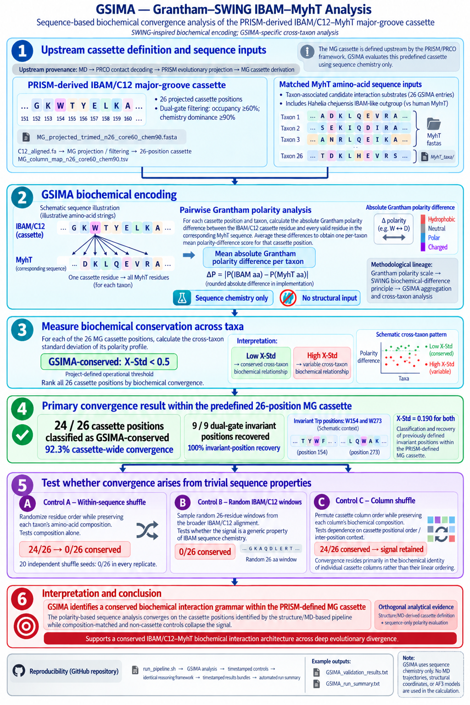

# GSIMA

**Grantham–SWING IBAM–MyhT Analysis**

Pronounced **gee-SIMA**.

Current release: **v3**

GSIMA is a sequence-based, cross-taxon biochemical-convergence analyzer for the PRISM-derived IBAM/C12orf29 major-groove (MG) cassette. It operates within the broader **Coiled-coil heptad complementarity (CCHC)** framework.

Earlier development versions of this analysis were referred to as **CCHC-SWING-Analyzer** or **SWING Lite**. **GSIMA** is the formal method and software name used hereafter.

---

## GSIMA pipeline overview



**Figure 1. GSIMA analytical workflow.** GSIMA evaluates the PRISM-derived 26-position IBAM/C12orf29 major-groove cassette against matched MyhT sequences using Grantham polarity differences and cross-taxon standard deviation (X-Std). The reference analysis classifies 24/26 positions as GSIMA-conserved (X-Std < 0.5) and recovers all 9/9 dual-gate invariant positions, including W154 and W273 (X-Std = 0.190 for both). Three internal controls test composition, cassette specificity, and dependence on cassette-column ordering.

---
## Conceptual framework

GSIMA operates downstream of the **Projected Residue Interaction-Space Mapper (PRISM)**.

The relevant analysis flow is:

```text
Molecular dynamics trajectories
        ↓
PRCO contact decoding
        ↓
PRISM evolutionary projection
        ↓
MG cassette derivation
        ├──────────────→ HARP register-enrichment analysis
        │
        └──────────────→ GSIMA biochemical-convergence analysis
```

The MG cassette is defined upstream by the structure/MD-based PRISM framework. GSIMA does **not** derive the cassette de novo. Instead, it evaluates the predefined cassette using sequence chemistry only.

**DALILite structural benchmarking is a separate project-level validation stream.** It tests whether IBAM shares the canonical RNA-ligase fold and is not an input to GSIMA.

---

## Methodological origin

GSIMA is a project-specific analytical framework inspired by **Sliding Window Interaction Grammar (SWING)**, originally developed by Siwek et al. (2025) as an interaction language model for peptide/protein interaction prediction.

SWING represents protein interactions by sliding windows across paired sequences and encoding amino-acid property differences as an interaction vocabulary.

GSIMA adopts the same broad biochemical-encoding principle for the IBAM/C12orf29–MyhT system, but does **not** reproduce the full SWING architecture. In particular, GSIMA does not use SWING's Doc2Vec embedding or downstream machine-learning classification framework.

Instead, GSIMA applies a custom cassette-specific aggregation and cross-taxon conservation analysis to a PRISM-derived IBAM/C12orf29 MG cassette and matched MyhT sequence inputs.

### Biochemical metric

GSIMA uses the **Grantham amino-acid polarity scale** (Grantham, 1974) as its biochemical metric.

For an amino-acid pair, the biochemical encoding is the absolute difference between their Grantham polarity values:

```text
ΔP = round(|P(IBAM aa) - P(MyhT aa)|)
```

where `P` denotes the Grantham polarity value.

This follows the biochemical-encoding principle used by Siwek et al. (2025), in which interacting amino-acid pairs are represented by absolute differences in a selected biochemical property.

The original SWING framework generates these pairwise encodings by positionally aligning a sliding window against a target sequence and subsequently incorporating the resulting interaction language into an embedding/classification pipeline.

GSIMA adopts only the **pairwise biochemical-difference principle**. Its downstream analytical logic is specific to this project:

1. For each IBAM/C12orf29 MG cassette position and each taxon, the cassette residue is compared against **all valid residues in the corresponding MyhT sequence**.
2. The resulting absolute Grantham polarity differences are averaged to produce a **per-taxon mean polarity-difference score** for that cassette position.
3. These per-taxon means are compared across taxa.
4. The **cross-taxon standard deviation (X-Std)** is used as the measure of biochemical conservation.
5. Positions with **X-Std < 0.5** are classified operationally as **GSIMA-conserved**.

Low X-Std indicates that a cassette position maintains a similar biochemical relationship to its MyhT sequence environment across divergent taxa. High X-Std indicates greater biochemical variability.

The `X-Std < 0.5` threshold is a **project-specific operational classification criterion**. It is not a threshold defined by Grantham or by the original SWING framework, and it should not be interpreted as a neutral-evolution threshold.

Thus, the methodological lineage is:

**Grantham (1974) → amino-acid polarity scale**  
**Siwek et al. (2025) → pairwise biochemical-difference interaction encoding**  
**GSIMA → cassette-specific aggregation and cross-taxon biochemical-conservation analysis**

The Grantham polarity scale and SWING biochemical-encoding principle provide the physicochemical and methodological foundations of GSIMA, while its aggregation strategy, cross-taxon statistic, classification threshold, and internal-control framework are GSIMA specific.

### SWING citation

Siwek, J. C., Omelchenko, A. A., Chhibbar, P., et al. (2025).  
*Sliding Window Interaction Grammar (SWING): a generalized interaction language model for peptide and protein interactions.*  
**Nature Methods**, 22, 1707–1719.  
https://doi.org/10.1038/s41592-025-02723-1

### Grantham polarity scale

Grantham, R. (1974).  
*Amino acid difference formula to help explain protein evolution.*  
**Science**, 185(4154), 862–864.  
https://doi.org/10.1126/science.185.4154.862

---

## Repository structure

```text
GSIMA/
│
├── data/
│   ├── C12_aligned.fa
│   ├── MG_column_map_n26_core60_chem90.tsv
│   ├── MG_projected_trimmed_n26_core60_chem90.fa
│   └── MyhT_fastas/
│
├── scripts/
│   ├── gsima_analysis.py
│   ├── make_gsima_controls.py
│   └── shuffle_replicate_test.sh
│
├── docs/
│   └── GSIMA_Methods_Results_Full.md
│
├── results_<timestamp>/
│   ├── GSIMA_validation_results.txt
│   └── GSIMA_run_summary.txt
│
├── controls_seed<seed>_<timestamp>/
│   ├── 01_within_sequence_shuffle/
│   ├── 02_column_shuffle/
│   ├── 03_random_IBAM_windows/
│   ├── logs/
│   └── results/
│
├── run_pipeline.sh
├── run_gsima.sh
├── run_controls.sh
├── run_seed_sweep.sh
├── GSIMA_Flowchart.png
└── README.md

```

Historical development files and diagnostic copies may retain the earlier `SWING` terminology. They are not part of the active GSIMA execution path.

---

## Input files

### `C12_aligned.fa`

Source evolutionary alignment used to derive the MG-projected cassette representation analysed by GSIMA.

Included for provenance and reproducibility.

---

### `MG_column_map_n26_core60_chem90.tsv`

Mapping table linking projected MG positions to source alignment coordinates.

---

### `MG_projected_trimmed_n26_core60_chem90.fa`

Final MG-projected cassette used for GSIMA analysis.

Represents the conserved IBAM/C12orf29 MG interaction cassette after dual-gate filtering:

- occupancy threshold ≥ 60%
- chemistry dominance threshold ≥ 90%

---

### `MyhT_fastas/`

Myosin-tail sequence inputs corresponding to the 26 GSIMA analysis entries.

The *Hahella chejuensis* IBAM-like outgroup is evaluated against human Myh7T, giving MyhT coverage for all **26 / 26** GSIMA entries.

These sequences represent the candidate MyhT interaction substrates evaluated against the conserved MG cassette.

---

## Installation

Tested on:

- Ubuntu Linux
- Python 3.10+

Install dependencies as required:

```bash
pip install numpy pandas biopython
```

---

## Running GSIMA

### Full reproducible pipeline

From the repository root:

```bash
./run_pipeline.sh
```

This will:

1. run the primary GSIMA analysis;
2. generate timestamped internal-control datasets;
3. score all control datasets using the same GSIMA framework;
4. generate timestamped result bundles; and
5. generate an automated GSIMA run-summary manifest.

A completed run reports:

```text
GSIMA pipeline complete.
```

---

### Run GSIMA analysis only

```bash
./run_gsima.sh
```

The standalone launcher runs `scripts/gsima_analysis.py` and writes the current summary output to:

```text
results/GSIMA_validation_summary.txt
```

---

### Generate and score controls

```bash
./run_controls.sh
```

The default control workflow generates three control datasets and scores each with the same GSIMA analysis.

---

### Seed-sweep robustness check

```bash
./run_seed_sweep.sh
```

This auxiliary analysis tests the robustness of the within-sequence shuffle result across multiple random seeds.

---

## Run outputs

Each full pipeline execution produces timestamped primary and control bundles.

Example:

```text
results_2026-09-12_14-35-43/
controls_seed20260505_2026-09-12_14-35-43/
```

### Primary results

```text
results_<timestamp>/
├── GSIMA_validation_results.txt
└── GSIMA_run_summary.txt
```

`GSIMA_validation_results.txt` contains:

- ranked positional convergence statistics;
- invariant-position recovery;
- tryptophan conservation analysis; and
- full GSIMA validation output.

`GSIMA_run_summary.txt` contains:

- headline convergence statistics;
- invariant-position recovery;
- invariant tryptophan recovery;
- control performance summaries; and
- run-level provenance information.

For the validated n26 reference run, the headline result is:

```text
GSIMA-conserved positions (cross-std < 0.5): 24 / 26
Invariant positions recovered by GSIMA:       9 / 9 (100%)
```

The two invariant tryptophan positions each have:

```text
cross-std = 0.190
```

---

## Internal controls

GSIMA includes three internal controls designed to distinguish cassette-specific biochemical convergence from trivial sequence properties.

### Within-sequence shuffle

Randomizes residue order within each cassette sequence while preserving that cassette sequence's amino-acid composition.

This tests whether the observed convergence can be explained by amino-acid composition alone.

For the validated reference run:

```text
GSIMA-conserved positions: 0 / 26
```

The collapse of the signal indicates that biochemical convergence depends on the organization of the cassette rather than composition alone.

---

### Column shuffle

Randomizes projected cassette column order while preserving the biochemical identity and composition of each column.

This control asks whether the GSIMA signal depends on fixed linear ordering of cassette columns or instead resides primarily in the biochemical properties of the individual conserved columns.

For the validated reference run:

```text
GSIMA-conserved positions: 24 / 26
Invariant positions recovered: 9 / 9
```

Retention of the signal after column shuffling is therefore mechanistically informative rather than a failed negative control. It shows that the conserved biochemical information resides primarily in the cassette columns themselves rather than their linear ordering.

---

### Random IBAM windows

Samples random windows of the same length from the broader IBAM/C12orf29 alignment.

This tests whether convergence is specific to the PRISM-derived MG cassette rather than a generic property of arbitrary IBAM/C12orf29 sequence windows.

For the validated reference run:

```text
GSIMA-conserved positions: 0 / 26
```

The collapse of the signal supports specificity of the PRISM-derived MG cassette.

---

## Biological interpretation

GSIMA does not test simple sequence conservation alone.

Rather, it asks whether predefined MG cassette positions maintain conserved **biochemical polarity relationships** to matched MyhT sequence environments across deeply divergent taxa.

Strong convergence within the PRISM-derived cassette, together with collapse of signal under the within-sequence shuffle and random-window controls, supports the interpretation that the IBAM/C12orf29 MG cassette carries a conserved biochemical interaction pattern rather than merely reflecting arbitrary local sequence similarity.

The column-shuffle control provides a distinct result: preservation of the GSIMA signal indicates that much of the detected biochemical constraint is intrinsic to the conserved cassette columns and does not require their original linear ordering.

The GSIMA calculation is methodologically orthogonal to the structure/MD calculations used upstream to define the cassette:

- **Upstream:** structure/MD-derived cassette definition
- **GSIMA:** sequence-only Grantham-polarity evaluation

No MD trajectories, structural coordinates, contact maps, AlphaFold3 models, or HARP register assignments are used in the GSIMA calculation itself.

This distinction is important: GSIMA provides an **orthogonal evaluation of a cassette defined upstream by PRISM**, not an independent de novo discovery of that cassette.

---

## Reproducibility

The full pipeline records timestamped primary and control outputs, including:

- the analysis timestamp;
- primary GSIMA results;
- generated control datasets;
- control result files;
- control logs; and
- a run-summary manifest.

A successful reference run should reproduce the characteristic result pattern:

```text
Primary MG cassette:       24 / 26 GSIMA-conserved
Within-sequence shuffle:    0 / 26
Column shuffle:            24 / 26
Random IBAM windows:        0 / 26
```

Numerical identity across code-renaming/refactoring runs was used as a regression check during the transition from the earlier CCHC-SWING-Analyzer naming to GSIMA.

---

## Citation

If you use this repository, please cite:

Friis TE. *C12orf29 encodes IBAM (In Between Actin and Myosin), a sarcomeric protein with a conserved actomyosin interaction grammar spanning approximately one billion years of evolution.* Manuscript in preparation.

Method/software name:

**GSIMA — Grantham–SWING IBAM–MyhT Analysis**

Please also cite the SWING and Grantham references above where the biochemical-encoding lineage is relevant.

---

## License

MIT License.

---

## Author

Thor Einar Friis

[](https://orcid.org/0000-0002-4132-4912)

Independent researcher, Bodø, Norway.  
PhD in Molecular Biology, Queensland University of Technology (QUT).
